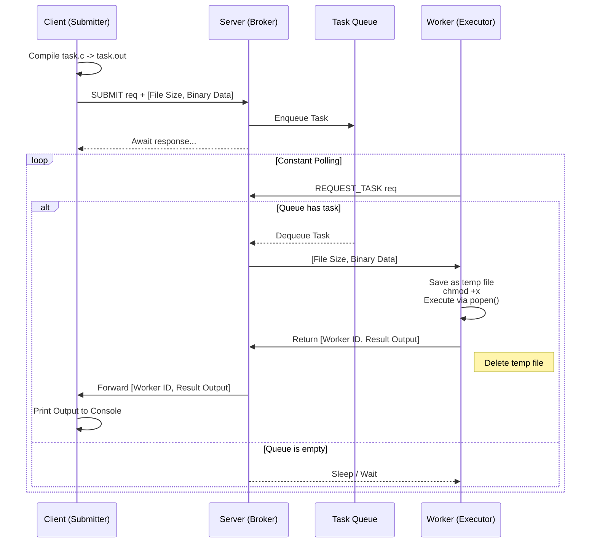

# Distributed Task Execution System

A C-based "Publisher-Subscriber" or broker model where a central Server routes compiled C executable tasks from Clients to Workers for remote execution. The system uses standard TCP sockets for network communication and C POSIX threads (pthreads) on the server to handle multiple connections concurrently.

## Architecture & Lifecycle

The lifecycle of a task follows a straightforward pull-based model for execution:



## System Components

1. **Server (`server.c`)**: Acts as a broker. It receives incoming code executables, places them in a thread-safe Queue (using `pthread_mutex` and `pthread_cond`), and dispatches them to available workers.
2. **Worker (`worker.c`)**: Runs on edge nodes. Workers maintain connections to the server, pull tasks, execute them safely on disk, and pipe the output strictly back to the Server.
3. **Client (`client.c`)**: Compiles `task.c` behind the scenes, submits its binary payload, and waits synchronously on its socket until the final standard output is echoed back.

## Setup and Build

The system uses standard `gcc` with POSIX threads. A simple `Makefile` is provided.

```bash
# Compile server, worker, and client
make

# Clean compiled binaries and temporary worker dumps
make clean
```

## Usage

You can deploy these pieces together locally (or to separate servers by configuring network IP addresses):

**1. Start the Server:**
```bash
./server
```

**2. Start one or more Workers:**
*(Open in a separate terminal. You can run as many workers as you want)*
```bash
./worker
```

**3. Submit a task:**
*(Ensure you have a `task.c` file written locally)*
```bash
./client
```

## Protocol Overview

Network communication uses explicit handshakes to ensure boundaries are maintained. 

**Client Submits:** `SUBMIT (1)` -> `File Size` -> `Binary Data`
**Worker Requests:** `REQUEST_TASK (2)` <- `File Size` <- `Binary Data`
**Worker Completes:** `Worker ID` -> `Output Size` -> `Output Data` (Server proxies this back to Client)
